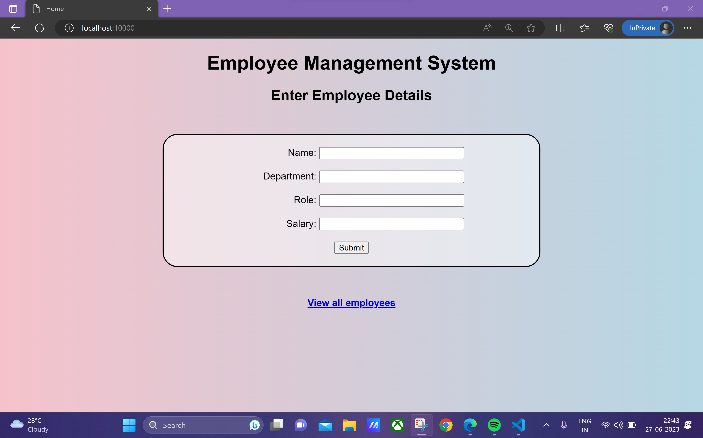
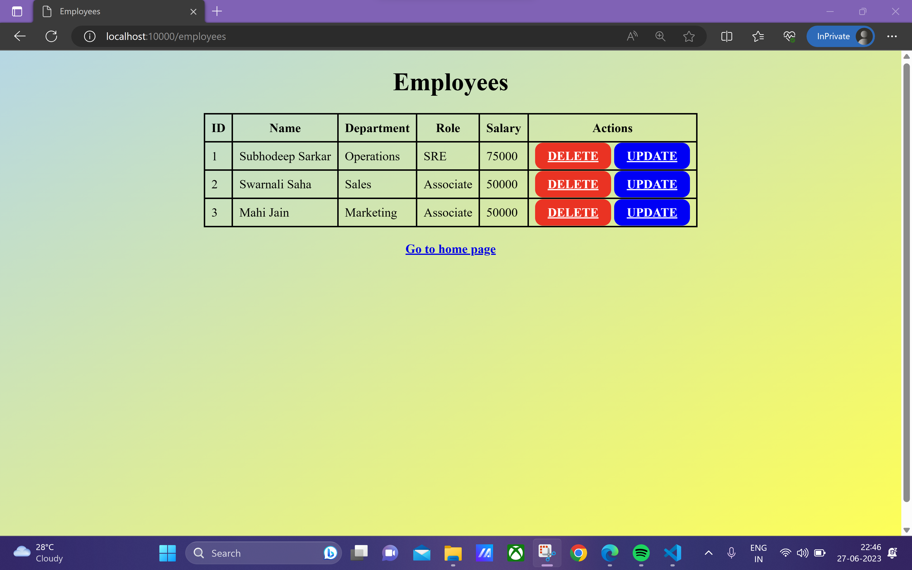

# Employee Management CRUD application
## By Subhodeep Sarkar

*This is the miniproject for C361 Wiley Edge. It is a employee management web application made using Flask* 

### Features
- Form validation using Regular Expression
- Docker image available
- Easy UI navigation

### Demonstration

 

### Docker, Jenkins, Kubernetes and AWS

*Dockerfile, Jenkinsfile, Test cases (test.py) and Kubernetes configuration file (emp-mgmt.yaml) can be found in the "docker" branch*

 

### Docker 🐳

**To pull docker image**
`docker pull h4ck3rd33p/employee-management-flask-app:latest`

 

**To run docker container**
`docker run -d -p <your_port>:10000 
h4ck3rd33p/employee-management-flask-app:latest`

 

### Kubernetes ☸️

**To deploy Kubernetes Cluster locally**
- install minikube 
- install kubectl-cli
- run `minikube start`
- To check if minkube is running and get the node ip using `kubectl get node -o wide`
- run `kubectl apply -f emp-mgmt.yaml`
- open browser and open `http://<ip>`
- alternatively, use ingress
- add ingress plugin using `minikube addons enable ingress`
- Add `<node_ip> employeelovescode.com` to `/etc/hosts` file
- open browser and open `http://employeelovescode.com`

 

### AWS ☁️

**To deploy Kubernetes Cluster on AWS EKS**
- install aws
- install kubectl-cli 
- Create IAM user with EKS permissions
- Create Access keys for that user and store it
- run `aws configure`
- enter your access and secret access keys
- enter your nearest region
- install eksctl
- run `eksctl create cluster --name <cluster_name> --nodes <max_nodes> --nodegroup-name <nodegroup_name> --node-type <instance_type>`
- check using `kubectl get node`
- run `kubectl apply -f emp-mgmt.yaml`
- get service ip using `kubectl get service emp-mgmt`
- open browser and open `http://<ip>`

⚠️ WARNING: AWS EKS is not free there are hidden charges associated. So make sure to destroy the cluster after you are done using `eksctl delete cluster --name <cluster_name>`. Contact AWS Support if you're mistakenly charged and they will revert it

 

### Jenkins 👨‍🍳

**Everytime there is a commit, the pipeline will work in the following way**
- Checkout into the "docker" branch of repository
- Run test cases (test.py) which checks if the status code is 200 for routes
- Build docker image
- Push it to Dockerhub
